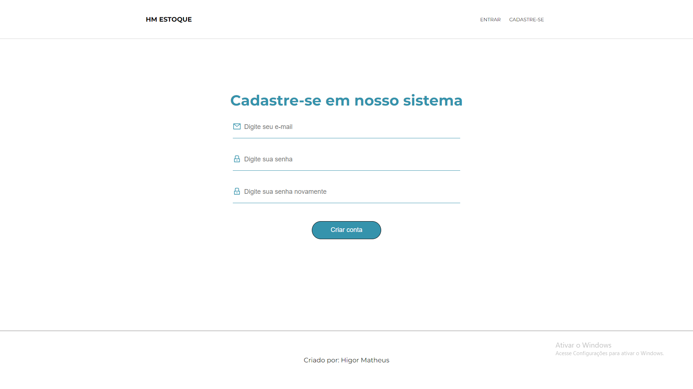
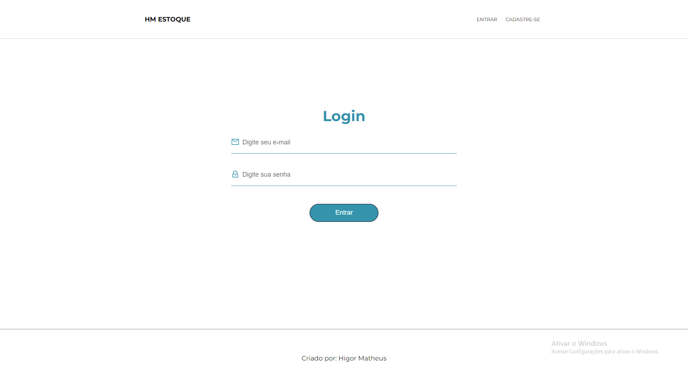

# PROJETO CONTROLE DE ESTOQUE
## Tecnologias utilizadas no projeto:
### Frontend:
* React
* React-router-dom
* React-Hooks
* React-icons
* TypeScript
### Backend:
* NodeJS
* MongoDB
* JWT
* BCrypt
* Express
### Arquitetura do projeto:
* Arquitetura MVC (Model, View, Controller)

Projeto desenvolvido para conseguir administrar o estoque de uma empresa, possuindo registro de usuário e também de produto, no registro de produto
existe um CRUD (Create, Read, Update, Delete) para possíveis erros e atualizações do usuário. O projeto também possui autenticação utilizando JWT e
criptografia utilizando o Bcrypt para armazenar a senha no banco de dados,. Também existem diversas validações tanto na área de criação de conta como
criação de produto, essas validações foram criadas tanto no frontend como no backend para gerar assim maior segurança e controle do que é criado.

Link do site do projeto: https://projeto-estoque-gamma.vercel.app/#/

## Imagens do Projeto:

### Tela Inicial:

### Tela de registro:

### Tela de login:

### Tela da área para controlar o estoque

### Tela da área para criar o produto

